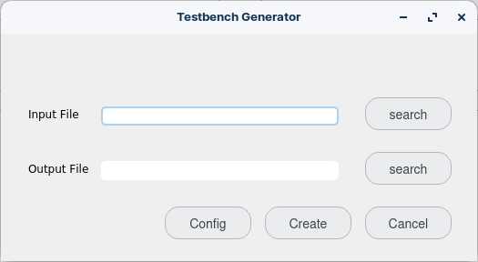

# HDLHelper
 HDL Tools

## HDLHelper current interface

## Tools

### Testbench generator
This tool generates a testbench with differents options

#### Options GUI

### Top file generator

This tool generates a top file 

### Ticks calculator

This tool calculates pulses

### HDL generator

This tool generates a hardware file while you write

### Documentation generator

This tool generates a documentation file in PDF

An example

